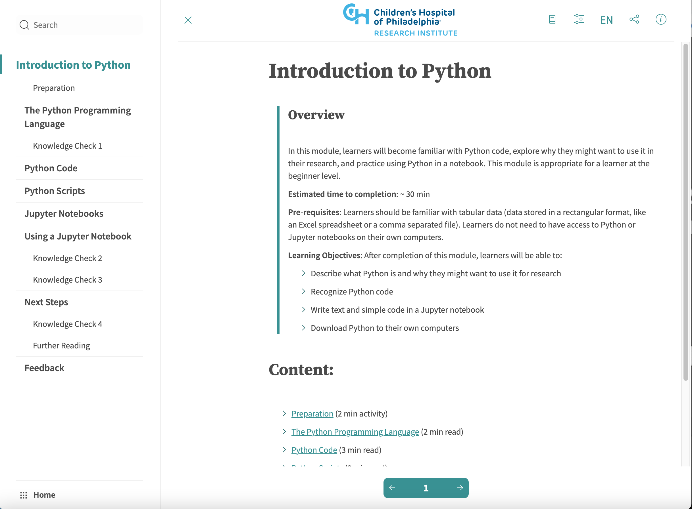
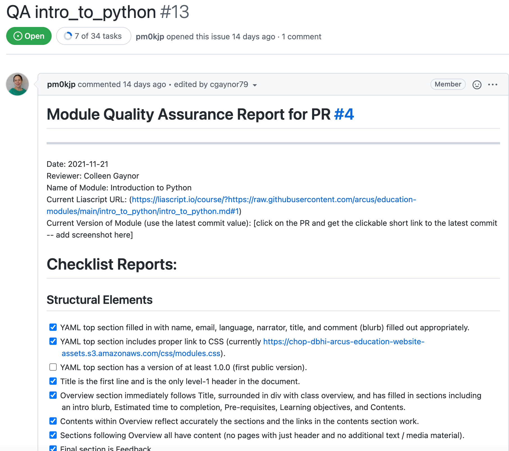

### Incorporating Inclusive Design into Open Education for Data Science
#### Rose Franzen and Rose Hartman 
 Arcus Data Education, Department of Biomedical and Health Informatics, Children's Hospital of Philadelphia  

Note: In the process of developing a self-paced, modular data science education program for biomedical researchers, we've kept accessibility at the front of our mind. Proactive vs reactive/retroactive a11y. At this point in our process, this is what that has looked like.

---

#### Inclusive Design
Building to be as universally usable in default state without the need for additional adaptations or solutions

#### Accessible
Reasonably feasible for an individual to engage with content without encountering inordinate burdens.

Note: within the context of our talk, this is what we mean. Not necessarily "formal" definitions
Accessibility and inclusive design are tall orders. While we want to help correct the history of barriers that have kept interested individuals from learning about and participating in this community, we also acknowledge that we are outsiders to the field of accessibility. Our goal today is to share a bit of what we've done so far in hopes that it oculd help someone else looking to make inclusive materials, but also to learn from you. Please feel free to chime in the chat or during Q&A with suggestions.
---

#### Two Approaches

- Static decisions
  - Across the board "rules" that aren't likely to negatively impact experience for any learners
    - e.g., avoiding figures of speech.

- Flexible options
  - Allow learners to match to their personal needs and preferences
    - e.g., information provided in multiple different modalities

Note: As we've considered accessibility throughout the development of our course, the choices we've made have fallen primarily into one of two categories.
Static design choices are  baked directly into the content and structure of our program. Do not vary across learners. Only implemented in cases where they are unlikely to harm the experience for any learners. For instance, we avoid figures of speech and idioms in our text -- individuals for whom English is not their first language + autistic learners. This decision is unlikely to reduce the accessibility of the material for other groups.
Wherever possible, we've built in flexibility. Accessibility is not a monolith, and the needs of one learner may conflict with the needs of another. (ex., spoken/auditory content for individuals with visual difficulties -- if switch to primarily utilizing auditory materials, now HoH folks encounter difficulties accessing content) Flexibility allows single source of content to meet needs of many. never provide information in a singular modality (e.g., there's always text to accompany auditory content, always audio descriptions to accompany visual content, etc.).

---

### Tools: Liascript

[Liascript](https://liascript.github.io/): a markdown-parser for creating courses

- Integrated text-to-speech functionality
- Learner control over text size, colors, dark mode
- Custom CSS
- Open source

---

### Tools: GitHub

GitHub: beyond transparency, version control, and collaboration
- Issues and integrated tasks
  - Quality assurance checklist for accessibility standards

Note: Materials hosted on GitHub, allowing individuals to further customize to their own needs if necessary. Utilizing markdown wherever possible ensures low barrier to entry for individuals wanting to improve accessibility of our materials. Support for Custom CSS not only allows us to customize presentation within tools, but also if helpful users can view our content through their own user style sheets.

---

### Resources

<ul class="small">
<li><a href="https://www.w3.org/WAI/WCAG21/quickref/">Web Content Accessibility Guidelines Quick Reference</a></li>
<li><a href="https://ukhomeoffice.github.io/accessibility-posters/posters/accessibility-posters.pdf">United Kingdom Home Office Accessible Design Posters</a></li>
<li>Inclusive Design Research Centre&#39;s <a href="https://guide.inclusivedesign.ca/">Inclusive Design Guide</a>, especially <a href="https://guide.inclusivedesign.ca/activities/inclusive-design-mapping/">the inclusive design mapping activity</a></li>
<li><a href="https://linktr.ee/eejackson">Liz Jackson</a></li>
<li><a href="https://user2021.r-project.org/blog/2021/11/04/accessibility_interview_liz_hare/">Liz Hare</a></li>
<li><a href="https://github.com/dataviza11y/resources">dataviza11y resources</a></li>
<li><a href="https://github.com/ajrgodfrey/LetsUseRNow">LetsUseRNow</a></li>
<li><a href="https://arxiv.org/abs/1909.05118">Sociotechnical Considerations for Accessible Visualization Design</a></li>
<li><a href="https://blindcomputing.org/">blind-computing</a></li>
</ul>

Note: Not nearly enough time to go over all of these -- encourage to check out, link to slides provided.
---

### Unsolved Issues
- Neither RStudio nor Jupyter Notebooks are fully accessible (maybe also cite?)
- Despite being text-based, command line interfaces are not inherently accessible (citation)

Note: While there are teams currently working to improve the accessibility of both RStudio and Jupyter notebooks, neither are currently up to standards.

---

### Thank You
Rose Franzen: franzenr@chop.edu
Rose Hartman: hartmanr1@chop.edu

