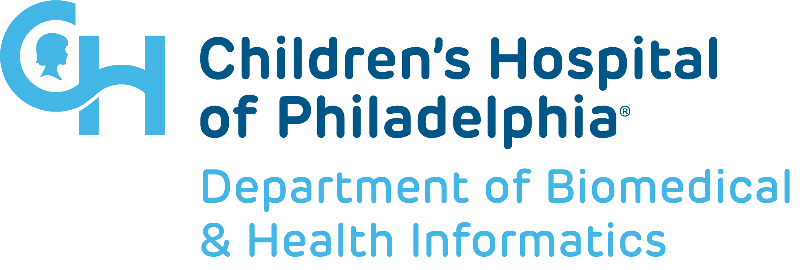

### Incorporating Inclusive Design into Open Education for Data Science
#### Rose Franzen and Rose Hartman 
 Arcus Data Education, Department of Biomedical and Health Informatics, Children's Hospital of Philadelphia  

Note: In the process of developing a self-paced, modular data science education program for biomedical researchers, we've kept accessibility at the front of our mind. Proactive vs reactive/retroactive a11y. At this point in our process, this is what that has looked like.

---

#### Two Approaches

- Static decisions
  - Across the board "rules" that aren't likely to negatively impact experience for any learners
    - e.g., avoiding figures of speech.

- Flexible options
  - Allow learners to match to their personal needs and preferences
    - e.g., information provided in multiple different modalities

Note: As we've considered accessibility throughout the development of our course, the choices we've made have fallen primarily into one of two categories.
Static design choices are  baked directly into the content and structure of our program. Do not vary across learners. Only implemented in cases where they are unlikely to harm the experience for any learners. For instance, we avoid figures of speech and idioms in our text -- individuals for whom English is not their first language + autistic learners. This decision is unlikely to reduce the accessibility of the material for other groups.
Wherever possible, we've built in flexibility. Accessibility is not a monolith, and the needs of one learner may conflict with the needs of another. (ex., spoken/auditory content for individuals with visual difficulties -- if switch to primarily utilizing auditory materials, now HoH folks encounter difficulties accessing content) Flexibility allows single source of content to meet needs of many. never provide information in a singular modality (e.g., there's always text to accompany auditory content, always audio descriptions to accompany visual content, etc.).

---

### Tools
- Liascript: a markdown-parser for creating courseware
  - Integrated text-to-speech functionality
  - Learner control over text size, colors, dark mode
  - Custom CSS

- Reveal-md: presentation slides from markdown
  - [Accessibility plugin](https://github.com/marcysutton/reveal-a11y) to add section labels to html
  - Custom CSS

Note: Materials hosted on GitHub, allowing individuals to further customize to their own needs if necessary. Utilizing markdown wherever possible ensures low barrier to entry for individuals wanting to improve accessibility of our materials. Support for Custom CSS not only allows us to customize presentation within tools, but also if helpful users can view our content through their own user style sheets.

---

### Implementation process
- Concrete documentation of standards
  - QA process for each module prior to release
- Ease of collaboration + future improvements
  - Open source

Note: QA checklist. Open source not only allows for improvements

---

### Resources

- [Web Content Accessibility Guidelines Quick Reference](https://www.w3.org/WAI/WCAG21/quickref/)
- [United Kingdom Home Office Accessible Design Posters](https://ukhomeoffice.github.io/accessibility-posters/posters/accessibility-posters.pdf)
- Inclusive Design Research Centre's [Inclusive Design Guide](https://guide.inclusivedesign.ca/)

Note: Not nearly enough time to go over all of these -- encourage to check out, link to slides provided.
---

### Unsolved Issues
- Neither RStudio nor Jupyter Notebooks are fully accessible

Note: While there are teams currently working to improve the accessibility of both RStudio and Jupyter notebooks, neither are currently up to standards.
